

# Manual Usuário do Sistema - Cadastro no SISPMAM 

## 1. Introdução

Bem-vindo ao **Manual do Usuário do Sistema – Cadastro no SISPMAM**. O processo de cadastro é simples e intuitivo, sendo fundamental para que o policial militar do Amazonas tenha acesso completo às funcionalidades do sistema.

---

[//]: # (centralize as imagens. Fundo Branco?)

## 2. Configurações Recomendadas

Para garantir o melhor desempenho e funcionamento do sistema, recomendamos as seguintes configurações mínimas:

### 2.1 Acesso pelo Computador
- Sistema Operacional
- Navegador Web
- Conexão com a Internet

### 2.2 Acesso pelo Celular
- Android
- Aplicativo SISPMAM
- Conexão com a Internet

---

## 3. Como se Cadastrar

O cadastro no SISPMAM é um processo simples. Basta seguir o passo a passo e as orientações explicativas.

### 3.1 Cadastro SISPMAM - Web

Siga o passo a passo após acessar o link: [https://sis.pmam.online/home](https://sis.pmam.online/home)

#### Passo 1:
Clique em Cadastrar.
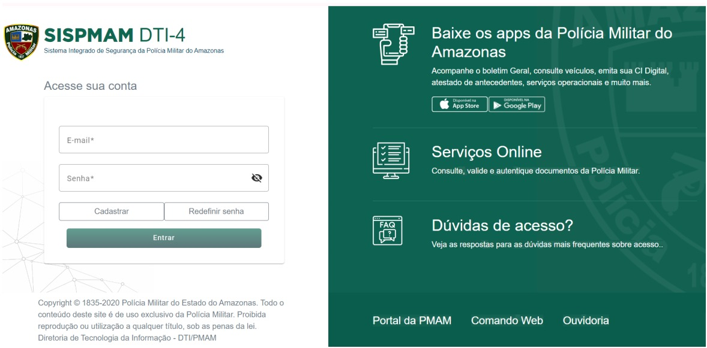

#### Passo 2:
Na página de Cadastro do usuário, preencha as informações dos campos em branco.
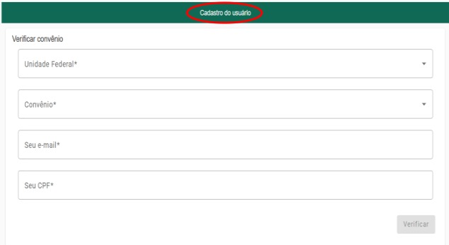

##### Obs. 1:
No campo Unidade Federal selecione Amazonas e no campo Convênio selecione PM/PMAM.

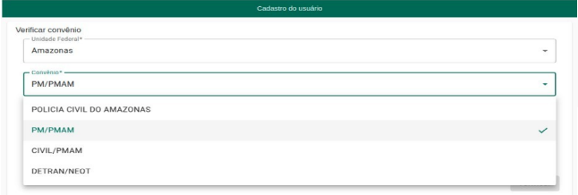

##### Obs. 2:
Digite seu e-mail e CPF, posteriormente clique no botão “Verificar”.

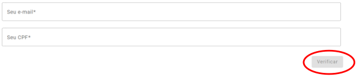

##### Obs. 3:
Certifique-se junto ao P-1 de sua unidade para que os campos função e e-mail constem preenchidos corretamente em sua ficha no Comando Web. O e-mail registrado no Comando Web será o mesmo a ser cadastrado no SISPMAM, logo, se houver divergências de informações a mensagem abaixo será exibida, e não será possível realizar o seu cadastro no SISPMAM.

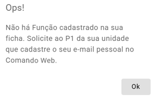

#### Passo 3:
Após a Obs. 2, o próximo passo é Cadastrar senha, no campo Seu e-mail aparecerá preenchido. No campo Sua senha preencha conforme as orientações no rodapé da tela ou Obs. 4, no campo seguinte confirme a senha criada e clique em Cadastrar senha.

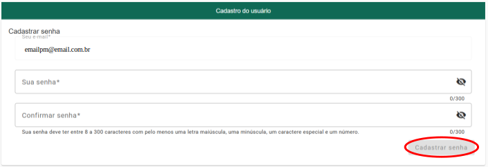

##### Obs. 4:
A senha deve conter o seguinte padrão para todos os usuários: uma letra maiúscula, uma letra minúscula, um número, um caractere especial (como, por exemplo: @, !, #) e possuir um tamanho de, no mínimo, 6 (seis) dígitos.

##### Obs. 5:
Ao concluir o Passo 3, será exibida a seguinte mensagem:

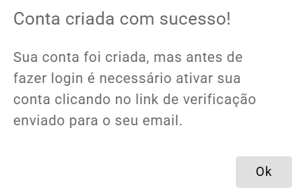

#### Passo 4:
Logar na sua conta de e-mail, a cadastrada no SISPMAM e Comando Web, procurar pelo e-mail da Polícia Militar do Amazonas, abra e siga as orientações.

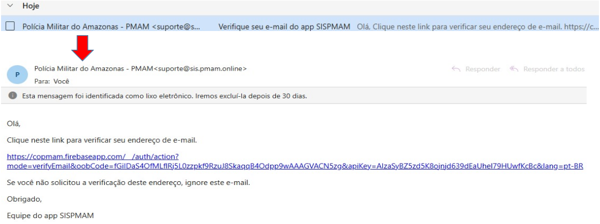

##### Obs. 6:
Ao concluir o Passo 4, será exibida a seguinte mensagem.

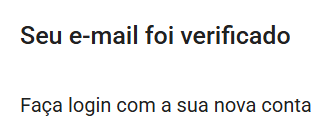

##### Lembre-se:
Ao acessar a sua conta sem ativá-la através do link, você receberá a mensagem de que seu e-mail não foi verificado, ou envie um novo link. O link de ativação será enviado para o seu e-mail, o mesmo cadastrado no Comando Web, é possível que seja encaminhado para a sua caixa de spam ou lixo eletrônico. Siga as instruções presentes no e-mail.

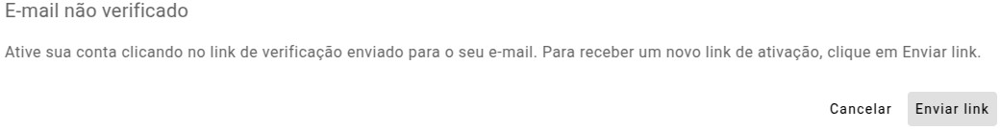

#### Passo 5:
Ao término de todos os passos anteriores, faça login na sua conta do SISPMAM digitando seu E-mail e Senha, em seguida clique em "Entrar".

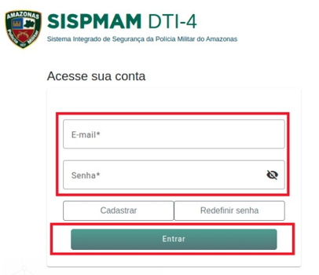

#### Passo 6:
Ao fazer seu primeiro login, seus dados já estarão preenchidos, exceto o campo data de nascimento, clique em no ícone calendário e posteriormente ano, mês e dia de nascimento. Não se esqueça de marcar as caixas para concordar com a política de privacidade e termos de uso.

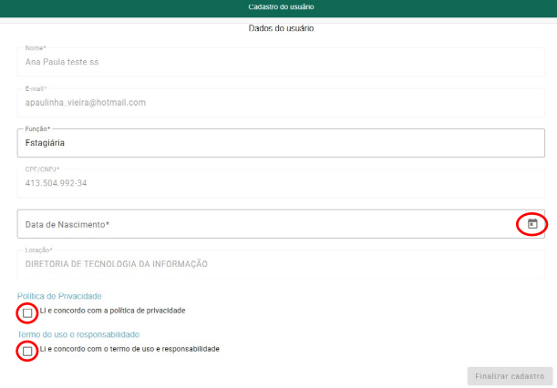

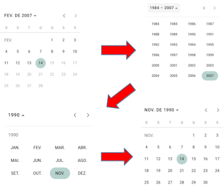

##### Obs. 7:
Redefinição de senha - Todos os usuários do SISPMAM que não possuem o padrão de senha - uma letra maiúscula, uma letra minúscula, um número, um caractere especial e no mínimo, 6 (seis) dígitos - devem redefinir a senha. Digite seu e-mail e posteriormente clique no botão Redifinir senha na página principal do SISPMAM e siga as instruções enviadas para o seu e-mail.

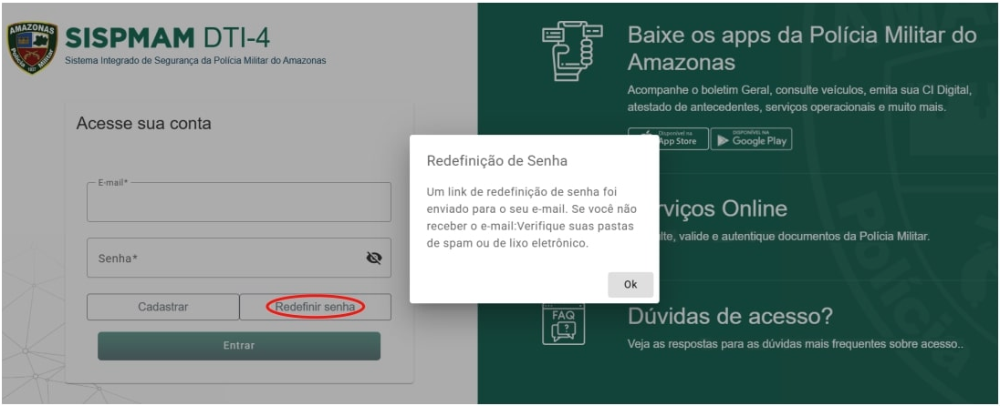

##### Obs. 8:
Essa é a tela do Policial Militar uma vez logado no SISPMAM. Clique em Sair para fazer logout.

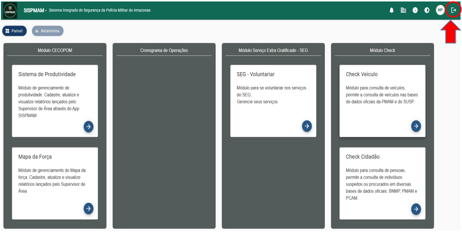

---
### 3.2 Cadastro SISPMAM - Aplicativo

#### Passo 1:
Baixe o aplicativo SISPMAM no Play Store.

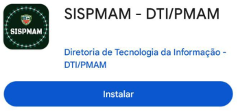

#### Passo 2:
Clique em Cadastrar.

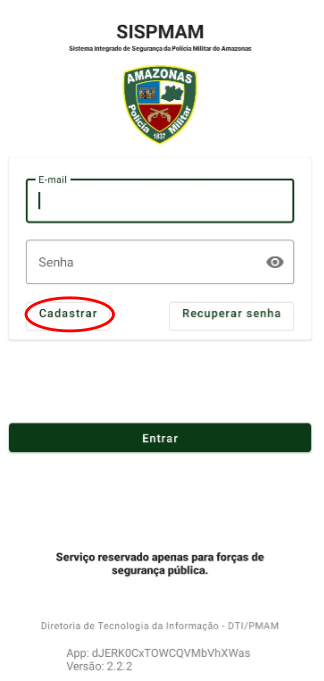

#### Passo 3:
Digite seu E-mail e CPF e clique no botão em Verificar.

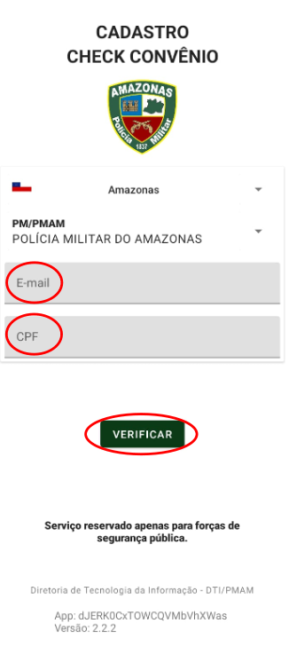

#### Passo 4:
Digite sua Senha e digite novamente no campo Confirmar senha, posteriormente clique no botão Cadastrar.

O campo E-mail não precisa preencher, pois aparecerá preenchido em virtude do cadastro na tela anterior.

A senha deve conter o seguinte padrão para todos os usuários: uma letra maiúscula, uma letra minúscula, um número, um caractere especial (como, por exemplo: @, !, #) e possuir um tamanho de, no mínimo, 6 (seis) dígitos.

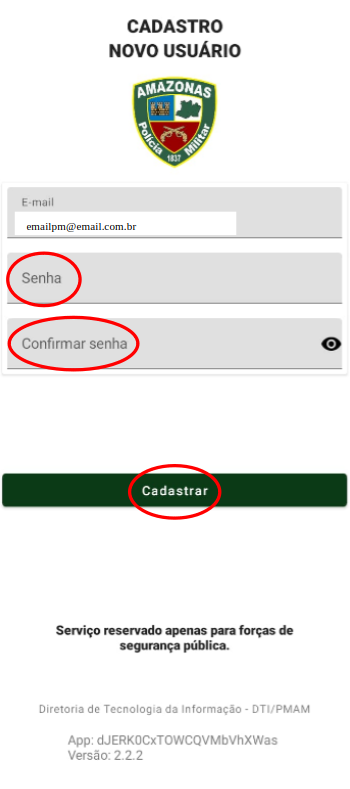

#### Passo 5:
Clique em OK.

Acesse sua conta de e-mail, a cadastrada no SISPMAM e Comando Web, procure pelo e-mail da Polícia Militar do Amazonas, é possível que seja encaminhado para a sua caixa de spam ou lixo eletrônico, abra e siga as orientações.

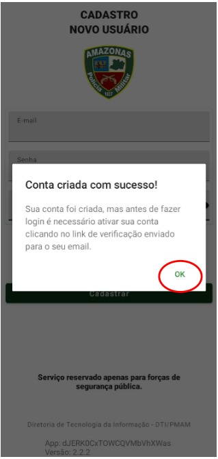

#### Passo 6:
Ao término das orientações enviadas para o e-mail, faça login digitando seu E-mail e Senha, em seguida clique em "Entrar".

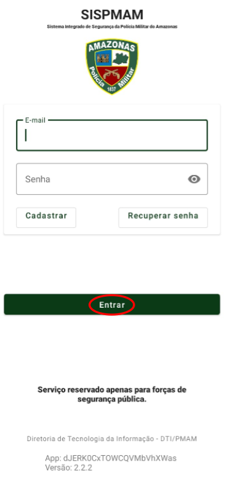

#### Passo 7:
Ao fazer seu primeiro login, seus dados já estarão preenchidos, exceto o campo data de nascimento e Cargo, complete seu cadastro. Não se esqueça de marcar as caixas para concordar com a política de privacidade e termos de uso. Ao concluir estará logado.

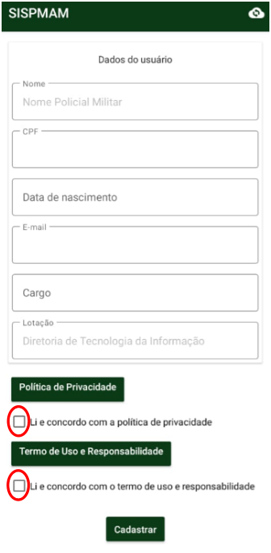

#### Passo 8:
Na tela logada, para sair do aplicativo clique no botão “Sair”, confirme a sua ação para fazer logout.

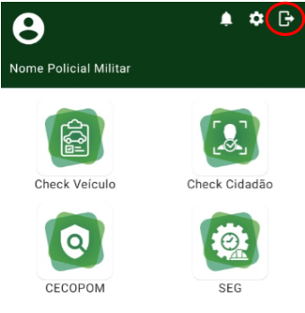

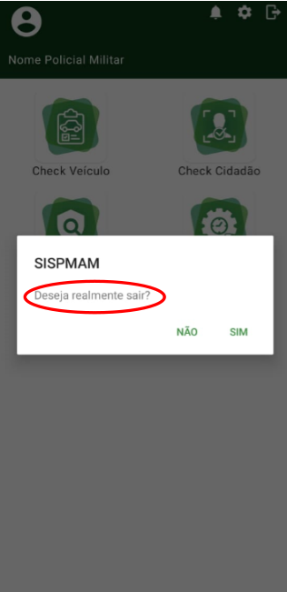

#### Passo 9:
Redefinição de senha/ Recuperar senha - Todos os usuários do SISPMAM que não possuem o padrão de senha - uma letra maiúscula, uma letra minúscula, um número, um caractere especial e no mínimo, 6 (seis) dígitos - devem redefinir a senha. Digite seu e-mail e posteriormente clique no botão Recuperar senha e siga as instruções enviadas para o seu e-mail.

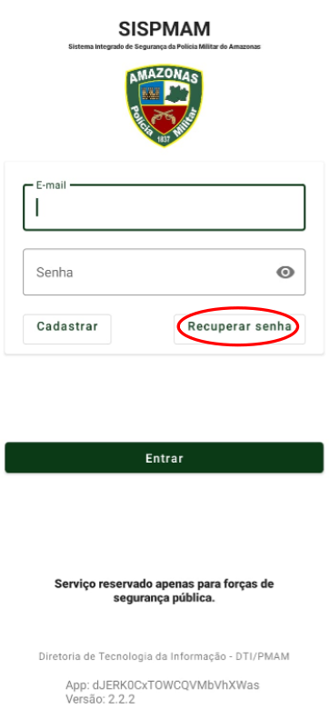

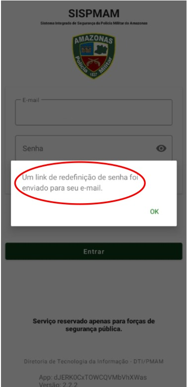

---

