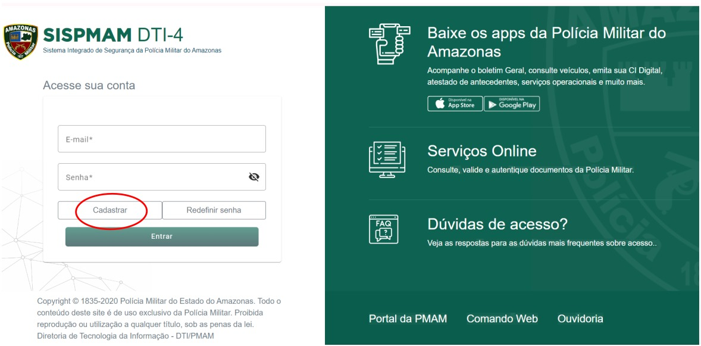
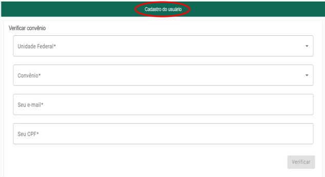
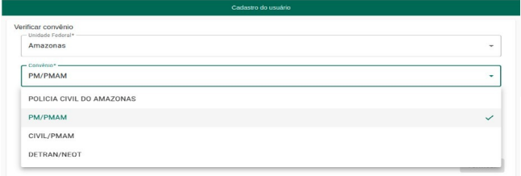

# Manual Usuário do Sistema - Cadastro no SISPMAM

## 1. Introdução

Bem-vindo ao **Manual do Usuário do Sistema – Cadastro no SISPMAM**. O processo de cadastro é simples e intuitivo, sendo fundamental para que o policial militar do Amazonas tenha acesso completo às funcionalidades do sistema.

---

## 2. Configurações Recomendadas

Para garantir o melhor desempenho e funcionamento do sistema, recomendamos as seguintes configurações mínimas:

### 2.1 Acesso pelo Computador
- **Sistema Operacional**
- **Navegador Web**
- **Conexão com a Internet**

### 2.2 Acesso pelo Celular
- **Android**
- **Aplicativo SISPMAM**
- **Conexão com a Internet**:

---

## 3. Como se Cadastrar

O cadastro no SISPMAM é um processo simples. Basta seguir o passo a passo e as orientações explicativas.

### 3.1 Cadastro SISPMAM - Web 

Siga o passo a passo após acessar o link: [https://sis.pmam.online/home](https://sis.pmam.online/home)

#### Passo 1: Clique em Cadastrar.

#### Passo 2: Na página de Cadastro do usuário, preencha as informações dos campos em branco.

##### Obs. 1: No campo Unidade Federal selecione Amazonas e no campo Convênio selecione PM/PMAM.

##### Obs. 2: Digite seu e-mail e CPF, posteriormente clique no botão “Verificar”.

### 3.2 Cadastro SISPMAM - Aplicativo 

